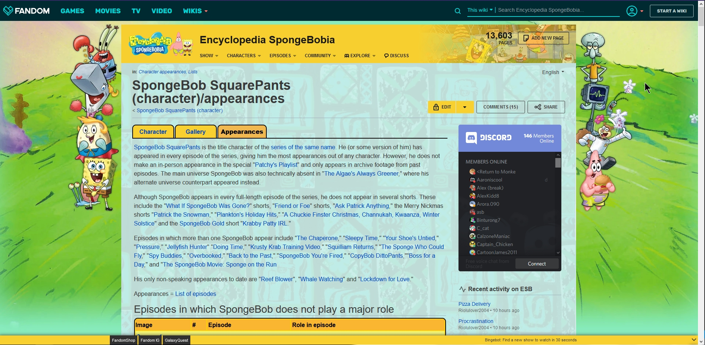

# fandom-fixer
I made a uBlock list that makes using Fandom wikis a bit more bareable to use.

Contributions and requests are always welcome!

[Subscribe](https://raw.githubusercontent.com/normanlol/fandom-fixer/main/filters.txt)

## Comparison
### Before

### After

See for yourself on [this page](https://spongebob.fandom.com/wiki/SpongeBob_SquarePants_(character)/appearances).
## How to Subscribe
### uBlock Origin
1. Copy the Subscribe Link

2. Open uBlock's dashboard

3. Scroll down to "Import" and tick the box next to it.

4. Paste the "Subscribe" link from above

5. Click "Apply changes" at the top.

6. That's all

